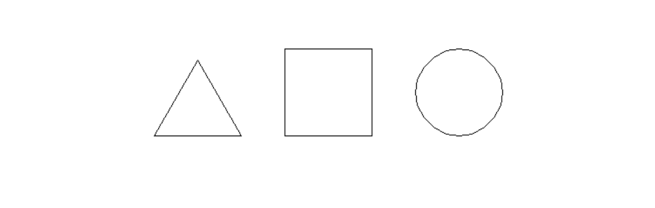
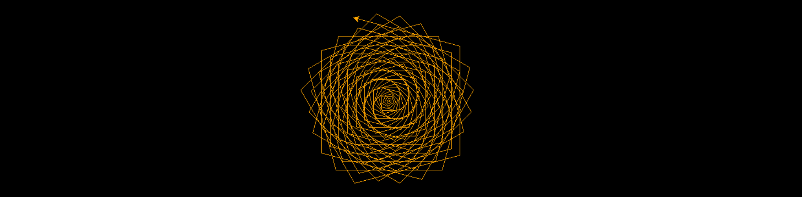

# Turtle

## Импорт

```python
import turtle
pen = turtle.Turtle()
turtle.mainloop() # зацикливает окно программы, чтобы оно не закрылось
```

## Основные команды

`turtle.forward(distance)`
Двигать черепаху вперёд на указанный distance, в сторону направления черепахи.

`turtle.backward(distance)`
Переместить черепаху назад на distance, противоположную направлению, в котором движется черепаха. Не меняет направление черепахи.

`turtle.right(angle)`
Повернуть черепаху направо на angle единиц. (Единицы измерения по умолчанию являются градусами, но могут быть установлены с помощью функций degrees() и radians()). Ориентация угла зависит от режима черепахи, см. mode()

`turtle.left(angle)`
Повернуть черепаху налево на angle единиц. (Единицы измерения по умолчанию являются градусами, но могут устанавливаться с помощью функций degrees() и radians()). Ориентация угла зависит от режима черепахи, см. mode()

`turtle.circle(radius, extent=None, steps=None)`
    - radius – число
    - extent – число (или None)
    - steps – целое число (или None)
Нарисовать круг с заданным radius. Центр — это radius единиц слева от черепахи; угол extent определяет, какая часть окружности нарисована. Если extent не указан, нарисовать весь круг. Если extent не является полным кругом, одна конечная точка дуги является текущим положением пера. Провести дугу против часовой стрелки, если radius положительный, в противном случае — по часовой стрелке. Наконец, направление черепахи изменяется на extent.

Поскольку окружность аппроксимируется вписанным правильным многоугольником, steps определяет количество шагов для использования. Если он не указан, он будет рассчитан автоматически. Может использоваться для построения правильных многоугольников.

`turtle.up()`
Прекратить рисование (поднять перо)

`turtle.down()` 
Возобновить рисование (опустить перо)

`turtle.hideturtle()`
Спрятать черепашку(стрелку)

`turtle.undo`
Отменить действие

`turtle.bgcolor('black')`

`turtle.color('orange', 'yellow')`

`turtle.setpos(x, y)`

`turtle.sety(y)`

`turtle.setx(x)`

`turtle.ycor()`

`turtle.xcor()`

`turtle.begin_fill()`

`turtle.end_fill()`

`turtle.tracer(1)`

`turtle.delay(0)`

`turtle.speed(0)`

## Квадрат, треугольник и круг



```python
import turtle

pen = turtle.Turtle()
pen.up()
pen.backward(50)
pen.down()
pen.forward(100)
pen.left(90)
pen.forward(100)
pen.left(90)
pen.forward(100)
pen.left(90)
pen.forward(100)
pen.right(90)
pen.up()
pen.forward(50)
pen.down()
pen.forward(100)
pen.right(120)
pen.forward(100)
pen.right(120)
pen.forward(100)
pen.left(60)
pen.up()
pen.forward(250)
pen.down()
pen.circle(50, 360)
pen.hideturtle()

turtle.mainloop()
```

## Pacman


````{toggle}
```python
from turtle import *
color('black', 'yellow')
speed(0)
up()
backward(100)
down()
begin_fill()
right(60)
circle(100, 300)
left(90)
forward(100)
right(120)
forward(100)
end_fill()
mainloop()
```
````

## Солнце


```python
from turtle import *
color('red', 'yellow')
begin_fill()
while True:
    forward(200)
    left(170)
    if abs(pos()) < 1:
        break
end_fill()
done()
```

## Солнце-мандала


```python
from turtle import *
bgcolor('black')
t = Pen()
t.color('orange', 'yellow')
score = 0
while True:
    score += 10
    t.forward(score)
    t.left(170)
```

## Солнце-мандала 2

```python
import turtle
turtle.bgcolor("black")
t = turtle.Pen()
turtle.tracer(2)
turtle.delay(0)
t.color('orange')
go = 1
for i in range(0, 200):
    t.forward(go)
    t.left(75)
    go+= 1
turtle.mainloop()
```

## Спираль

```python
from turtle import *

tracer(3)
radius = 0
extent = 120
while radius < 100:
    radius += 1
    circle(radius, 90)
mainloop()
```

## Треугольная спираль


```python

import turtle

turtle.setup(700,700)
turtle.title("Spiral")
turtle.speed(0)
turtle.hideturtle()
n=200
s=2
for i in range(n):
    turtle.fd(s)
    turtle.left(119)
    s += 2
turtle.mainloop()

```

## Мячик и след


<details><summary>Решение</summary>
<pre>
<code class="language-python">

import turtle
import time
gravity = -0.005  # pixels/(time of iteration)^2
y_velocity = 1  # pixels/(time of iteration)
x_velocity = 0.25  # pixels/(time of iteration)
energy_loss = 0.95

width = 600
height = 800

window = turtle.Screen()
window.setup(width, height)
window.tracer(0)

ball = turtle.Turtle()
ball.penup()
ball.setx(-600)
ball.sety(-300)
ball.color("green")
ball.shape("circle")
ball.sety(ball.ycor() + y_velocity)
ball.pendown()
while True:
    ball.sety(ball.ycor() + y_velocity)
    ball.setx(ball.xcor() + x_velocity)
    ball.circle(1, 360)
    print(ball.ycor(), ball.xcor())
    y_velocity += gravity
    if ball.ycor() < -height / 2:
        y_velocity = -y_velocity * energy_loss
    window.update()

</code>
</pre>
</details>

```python
import turtle
import time
gravity = -0.005  # pixels/(time of iteration)^2
y_velocity = 1  # pixels/(time of iteration)
x_velocity = 0.25  # pixels/(time of iteration)
energy_loss = 0.95

width = 600
height = 800

window = turtle.Screen()
window.setup(width, height)
window.tracer(0)

ball = turtle.Turtle()
ball.penup()
ball.setx(-600)
ball.sety(-300)
ball.color("green")
ball.shape("circle")
ball.sety(ball.ycor() + y_velocity)
ball.pendown()
while True:
    ball.sety(ball.ycor() + y_velocity)
    ball.setx(ball.xcor() + x_velocity)
    ball.circle(1, 360)
    print(ball.ycor(), ball.xcor())
    y_velocity += gravity
    if ball.ycor() < -height / 2:
        y_velocity = -y_velocity * energy_loss
    window.update()

```

