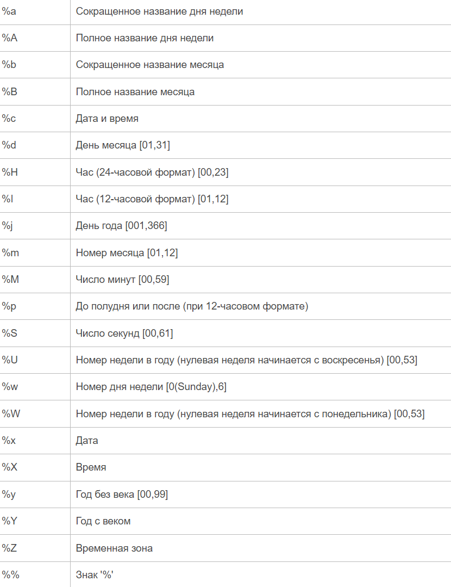

# План обучения `py`

## Установка Vs Code + Python.
1. https://code.visualstudio.com/download
2. https://www.python.org/downloads/
3. RuLang: Шестерёнка -> Command Pallete -> Вводим 'lang' -> Configure Display Language -> 'Русский'
4. Расширение Python 
5. Расширение Code Runner 
6. Параметры:
    - Установить стандартное автосохрание -> Файл -> Автосохранение
    - Изменить шрифт -> editor.fontSize -> 16
    - Code-runner: Save file before run [галочка стоит]
    - Code-runner: Run in terminal [галочка стоит]
7. Settings.json
    -Очистка консоли:
        "code-runner.executorMap": {
            "python": "clear; python -u" }
8. Создать папку на рабочем столе -> Открываем её в Vscode -> Далее создаем два файла -> main.lua/py theory.lua/py

## Введение.

    print("Hello World")
    Что такое комментарии.

## Переменные.

    -Зачем они нужны, как мы бы жили без них.
    -Оператор присваивания; Каждый символ в программировании важен, в том числе пробел.
    -Представляем, что переменная это коробка в которую мы можем поместить только одно значение.
        name = 'Ivan'
    -Как можно и как нельзя создавать переменные.
        -Название переменной желательно должно соответствовать ее содержанию.
        -Можно: 
            isName = None
            my_name = None
            number1 = None
            k0l0b0k = None
            KEK = None
        -Нельзя: 
            1var 
            использовать название команд
            спец символы !@#
    -Программа читает код каждую строку поочереди.
    -По этому, одна и та же переменная может иметь различные значения в разных частях кода:
        a = 'one'
        print(a)
        a = 'two'
        print(a)
    -Чувствительность к верхнему и нижнему регистру:
        a = 0
        A = 1
    -Как поместить значение переменной в другую переменную:
        a = 42
        b = a
        -Сперва читаем то что справа от равно, а потом слева от равно.
    -Поменять значения переменных: a, b = b, a
    -Каскадное присваивание: x=y=z=0
    -Множественное присваивание: x, y, z = 1, 2, 3
    -Как обозначается ничего: None


    -Типы данных или Типы переменных.
    - str - СТРОКИ - определяются кавычками "_" или '_'
    - int - ЧИСЛА - только цифры, без пробелов и кавычек.
    - bool - ЛОГИКА -  логическое значение, может содержать True/False (обязательно писать с большой буквы)
    -Каждый тип можно представить в виде комнаты со своими правилами.
    -Примеры.
        К числам можно применять знак минус, а к строкам и логике - нет.
        Сравнение 10 и '10'
    -type() - функция показывающая тип переменной
    На самом деле почти всё имеет свой тип. Остальные типы данных будем проходить на следующих уроках.
    -Функции для изменения типов:
        str()
        int()
        bool()

## Ввод/Вывод.

    -input('text')
    -print(end=, sep=)

## Арифметические операторы и операции.

    - (+ - * / // % **)
    - Приоритет действий и операций - https://letpy.com/handbook/operator-priorities/
    - Бинарный и унарный операторы.
    - минус "-" меняет знак числа на противоположный
    - тип данных float
    - None (ничего)
    - Функции.
        abs(x) - вычисляет модуль числа x
        round(x, y) - округляет x до ближайшего целого. y - максимальное кол цифр после запятой
        min(x1, x2,?,x_n) - находит минимальное, среди указанных чисел
        max(x1, x2,?,x_n) - находит максимальное, среди указанных чисел
        pow(x, y) - возводит x в степень y
    - import math, методы.
        math.ceil(x) - возвращает ближайшее наибольшее целое для x
        math.floor(x) - возвращает ближайшее наименьшее целое для x
        math.fabs(x) - возвращает модуль числа x
        math.factorial(x) - вычисляет факториал x!
        math.exp(x) - вычисляет e**x
        math.log2(x) - вычисляет логарифм по основанию 2
        math.log10(x) - вычисляет логарифм по основанию 10
        math.log(x, [base]) - вычисляет логарифм по указанному основанию base (по умолчанию base = e ? натуральный логарифм)
        math.pow(x, y) - возводит число x в степень y
        math.sqrt(x) - вычисляет квадратный корень из x
    
        -Тригонометрические функции
            math.cos(x) - вычисляет косинус x
            math.sin(x) - вычисляет синус x
            math.tan(x) - вычисляет тангенс x
            math.acos(x) - вычисляет арккосинус x
            math.asin(x) - вычисляет арксинус x
            math.atan(x) - вычисляет арктангенс x
    
        -Математические константы
            math.pi - число пи
            math.e - число e

## Условные и логические операторы.
    - > < >= <= == !=
    - in
    - not in

## Логические операторы.

    - and, or. 
    - not
    - is
    - and имеет больший приоритет чем or

## Строки.
    -Есть два вида кавычек "text" и 'text'
    -"""Многострочные строки""", '''Многострочные строки, пример 2'''
    -Перевод строки \n: 'hello\nworld'
    -Пустая строка: ""
    -Конкатенация или cоединение строк: 'str1' + 'str2'; 'str1' + ' ' + 'str2'
    -Умножение строк: 'str' * 10
    -Проверка наличия в строке той или иной подстроки: 'abc' in str1
    -Форматирование строки:
        platypus = "Алекс"
        pig = "Пепе"
        "Утконос %s шел мимо поля" % platypus
        "Утконос %s шел мимо поля и встретил свинку %s" % (platypus, pig)
        f"Утконос {platypus} шел мимо поля и встретил свинку {pig}"
    
    -Индексы, тип str, str[-1]
    -Cрезы [5:10] [0:-1] [start:stop:step]
    -Реверс строки: [::-1]
    -len(str)
    -ord(), id(), chr()
    -Сравнение строк с помощью условных операторов:
        "ABC" != 'abc'; (пример с логином и паролем)
        'a' < 'b' (разобрать, почему это True)
    -Изменение строки, добавление/удаление символов в конце/начале/середине.
        msg = "Hello World!"
        newmsg = msg[:6]+"w"+msg[7:9]+msg[10:]

    
    -Что такое методы, как они работают, "возвращаемые и невозвращаемые".
    -Методы строк. 
        str.upper() - буквы становятся большими
        str.lower() - буквы становятся маленькими
        str.count('ra', start, stop) - посчитать сколько вхождений 'ra' (start, stop - можно использовать срезы)
        str.find('a', start, stop) - находит индекс первого 'a', слева направо. возвращает -1 если буквы нет
        str.rfind() - работает так же как find, но начинает поиск справа
        str.index('a') - аналог find, возвращает ошибку если буква не найдена
        str.replace('a', 'b') - меняет все 'a' на 'b'
        str.replace('a', 'b', amount) - меняет все 'a' на 'b', amount - максимальное количество замен
        str.isalpha() - возвращает True, если все символы являются буквами, иначе False.
        str.isdigit() - возвращает True, если все символы являются цифрами, иначе False.
        str.rjust(10, '!') - добавляет символы слева строки, если индексов меньше 10.
        str.ljust() - тоже самое что rjust, только справа.
        str.split() - разбивает строку в местах где есть пробелы, на выходе получаем список.
        str.split('-') - аналогично. разбивает строку в местах где есть символ '-'. Вместо '-' можно использовать любой другой символ. 
        str.strip() - удаляет пробелы и переносы строк в начале и конце строки.
    
        '...'.join(list) - соединяет все элементы списка в строку, между элементами ставится "..." (важно, чтобы в list были только элементы с типом str)
    
        str.isupper() - возвращает True, если все буквы в строке верхнего регистра.
        str.islower() - возвращает True, если все буквы в строке нижнего регистра.

## Условия.

    -Что такое табуирование? Это отступы, которые ставятся с помощью клавиши TAB.
    -Что такое заголовок/тело
    -if (заголовок, тело условия)
    -if-elif-elif-elif-elif-else (> < >= <= == !=)
    -Наличие тока для включения лампочки.
        tok = false
        if tok == true then
            print('Лампа включена')
    -Неплохой пример, показывающий поэтапность действий, и то что при первом срабатывании условия оно останавливается.
        temp = int(input())
        if temp > 10:
            print('Погода атас, бежим гулять!')
        elif temp > 0:
            print('Идем гулять, но нужно взять теплые вещи!')
        elif temp < 0:
            print('Остаемся дома и смотрим кино')
        else:
            print('Ого, нулевая температура')
    -одиночные проверки, if var > 5: print('hello')
    -сравнение строк
    -and, or и not (снова повторить)
    -пример: входит ли число в диапазон чисел от 0 до 10
    -пример: одно число входит в диапазон, а другое не входит
    -Тернарный условный оператор:
        a, b = 12, 7
        var = True if a > b else False
    -Как найти четное число:
        n = int(input())
        if n % 2 == 0:
            print('число четное')
        else:
            print('число не четное')
    -Является ли переменная строкой:
        s = 'took-took'
        if type(s) == str:
            print('да')
        else:
            print('нет')

## Списки.

    -пример списка
    -тип list
    -вывести весь список
    -обратится к одному элементу по индексу
    -добавление в список lst.append()
    -удаление из списка lst.remove()
    -удаление элемента списка по индексу del lst[1]
    -заменить элемент lst[0] = 'new'
    -срезы [5:10] [0:-1] [start:stop:step] [::-1]
    -соединение списков lst = [1,2,3] + [4,5,6]
    
    
    -положить элемент в середину списка с помощью соединения
        lst = ['a','b','d']
        lst = lst[:2] + ['c'] + lst[2:]
        print(lst)
    -длина списка функцией len()
    -создание пустого списка 
    -быстрое создание большого списка с помощью умножения lst = [0]*100
    -список может содержать любой другой тип данных
    -найти элемент списка в списке list[0][0]
    -'abc' in lst
    -функция list(), например переводит строку в список
    -функции max(lst) min(lst)
    -сумма элементов sum(lst)
    -sorted(lst) - функция сортировки чисел по возрастанию; sorted(lst, reverse=True) - по убыванию.
    -сравнение списков lst == lst (> < и т.д.)
    
    -методы списков:
        list.append(element) - Добавляет элемент в конец списка
        list.extend([element1, element2]) - Добавляет сразу несколько элементов в список
        list.remove(element) - Удаляет элемент по значению
        list.insert(index, element) - Вставляет элемент в указанное место списка
        list.pop() - Удаляет последний элемент, либо элемент с указанным индексом в скобках
        list.clear() - Очищает список (удаляет все элементы)
        list.copy() - Возвращает копию списка
        list.count(value) - Возвращает число элементов с указанным значением value
        list.index(element) - Возвращает индекс первого найденного элемента element
        list.reverse() - Меняет порядок следования элементов на обратный
        list.sort() - Сортирует элементы списка
    
    sorted(lst) - сортировка по возрастанию
    sorted(lst, reverse=True) - сортировка по убыванию
    ''.join(line) - соединяет все элементы списка в одну строку (важно, чтобы в list были только элементы с типом str)
    '-'.join(list) - тоже самое, только между элементами ставится "-"
    del list[0] - удаление элемента по индексу

## Циклы.   

    -ВАЖНО! Показывать работу циклов примера с мельницей. Расписывать полностью поэтапность действий цикла!
    -Итерация - это одно повторение цикла.
    -while (заголовок, тело цикла)
        -работает, когда имеет значение True
    -условные операторы в цикле (можно писать все те же самые условия, что и в условном операторе if)
        -счетчик
        -перебрать цифры до 100
        -перебрать цифры от 50 до 100
    -for
        -имеет собственную переменную; перебирает элементы
        -range(start, stop, step) - создает расстояние между двумя цифрами "start" и "stop", с указанным шагом "step";  range(10,0,-1)
        -с помощью for можно перебирать элементы списка или строки
            пример: изменение всех элементов списка
    -break, continue, else
        break - остановка цикла
        continue - переход на следующую итерацию
        else - срабатывает после остановки цикла, не работает с break
    -сокращения += -= *= /= //= %= **= 
    -input() внутри циклов
    -10 in range(0,20)
    -вложенные циклы(цикл внутри цикла).
        # Создание матрицы 5х5:
            A = []
            for y in range(5):
                A.append([])
                for x in range(5):
                    A[y].append(x)
            # print(A)
        # Вывод матрицы:
            for i in range(5):
                for j in range(5):
                    print(A[i][j])
                print()

## Генераторы списков. list comprehensions.

    -Пример без генератора:
        A=[]
        N=10
        for x in range(N):
            A.append(x**2)
        print(A)
    -Пример с генератором:
        N=10
        A = [x**2 for x in range(N)]
        print(A)
    -Список только из четных чисел  [x**2 for x in range(N) if x % 2 != 0]
    -Простой список из очереди цифр
    -Выборка слов состоящих максимум из 7 букв:
        cities = ["Москва", "Тверь", "Рязань", "Ярославль", "Владимир"]
        A = [city for city in cities if len(city) < 7]
        print(A)
    -Вложенные генераторы списков
        M, N = 3, 4
        matrix = [[a for a in range(M)] for b in range(N)]
        print(matrix)

## Алгоритмы обработки списков.

    -Видео https://youtu.be/gMM7632kTkI?t=267 (4:27)

## Кортежи. (((notrdy)))

    -Кортежи это неизменяемые списки.
    -Они меньше занимают памяти.
        a = (1,2,3,4,5)
        b = [1,2,3,4,5]
        print(a.__sizeof__())
        print(b.__sizeof__())
    -Создание кортежа:
        new_tpl = tuple()
        new_tpl = ()
        new_tpl = ('a')   - не получится
        new_tpl = ('a',)
        new_tpl = 'a',
    -Разбить строку на кортеж: tuple('str')
    -Индексы и срезы
    -Конкатенация, умножение
    -Операции in/not in
    -Кортеж можно перебирать с помощью for
    
    -Методы кортежей.
        tuple.index(element) - Поиск позиции элемента в кортеже
        tuple.count(element) - Количество вхождений элемента в кортеж

## Словари.

    -Тип dict.
    -Похожи на списки, только нужно самостоятельно создавать индексы для элементов. Это называется ключ:значение. В списках мы находили значение по индексу, а здесь по самостоятельно созданному ключу.
    -{Ключ:значение}
    -Создание словаря: d = {'key1':'value1', 'key2':'value2', 'key3':'value3'}  
    -Найти значение по ключу: d['key1']
    -Добавить новый ключ: d['new_key'] = 'new_value'
    -Заменить значение по ключу: d['key2'] = 'Cyan'
    -Удалить ключ: del d['key3']
    
    -Названия ключей могут быть: int, str, bool, tuple или любой другой неизменяемый тип данных; (например, list - изменяемый). У значений нет орграничений.
    -Названия ключей уникальны, если создать два одинаковых ключа, то будет работать последний.
    -Функция-конструктор dict() 
        d2 = dict(house = "дом", car = "машина", tree = "дерево", road = "дорога", river = "река")
            lst = [[2, "неудовлетворительно"], [3, "удовлетворительно"], [4, "хорошо"], [5, "отлично"]]
            d3 = dict(lst)
    -dict.fromkeys() - Возвращает словарь, сформированный из указанной последовательности(например, из списка)
        a = dict.fromkeys(["+7", "+6", "+5", "+4"])
        a = dict.fromkeys(["+7", "+6", "+5", "+4"], "value")
    -После удаления несуществующего ключа возникнет ошибка.
    -Проверка существует ли определенный ключ в словаре: 'abc' in d; или наоборот: 'abc' not in d
    -Пустой словарь d = {}; d = dict()
    -len(d)
    -Словарь можно перебрать через цикл for
    
    -Сортировка.
        sorted(d) - сортировка по возрастанию ключей
        sorted(d, reverse=True) - сортировка по убыванию

    -Методы словарей.
        dict.clear() - Удаление всех записей
        dict.copy() - Создание копии словаря
        dict.get(key) - Позволяет получать значение словаря по ключу (при указании неверного ключа не возникает ошибки, а выдается по умолчанию значение None)
        dict.get("Несуществующий_ключ", False) - При ошибке будет выводится False
        dict.setdefault(key[, default]) - Возвращает значение ключа key и если его нет, то добавляет его в словарь со значением None, либо со значением default, если оно указано
        dict.pop(key) - Удаляет указанный ключ и возвращает его значение
        dict.pop("abc", False) - Здесь возвратится False. Если же ключ присутствует, то возвращается его значение.
        dict.popitem() - Удаляет и возвращает последний ключ:значение в виде кортежа (key, value)
        dict.keys() - Возвращает коллекцию ключей (Удобно использовать в цикле for)
        dict.values() - Возвращает коллекцию из значений словаря (Удобно использовать в цикле for)
        dict.items() - Возвращает записи в виде кортежей: ключ, значение (Удобно использовать в цикле for)
        dict.update({key:value}) - Позволяет дополнить словарь новыми значениями, или обновить существующие ключи с новыми значениями
    
        dict.fromkeys() - Возвращает словарь, сформированный из указанной последовательности(например, из списка)
            a = dict.fromkeys(["+7", "+6", "+5", "+4"])
            a = dict.fromkeys(["+7", "+6", "+5", "+4"], "value")

## Множества.

    -Тип set
    -Множество ? это неупорядоченная коллекция уникальных элементов.
    -Пример: a = {1, 2, 3, "hello"}
    -Повторяющиеся значения будут проигнорированы: a = {1,2,3,"hello", 2,3, "hello"}
    -Можно использовать только неизменяемые типы: str, int, tuple
    -Функция set() позволяет создать множество:
        a = set()
        b=set("hello world!")
        c=set([1,1,2,3,5,3,2,1])
        d=set(range(7))  - или даже функцию range()
    -Невозможно создать множество с помощью b = {} - это будет словарь
    -Пример удаление всех дубликатов в списке:
        a=[1,2,3,43,2,4,3,2,1]
        b=set(a)
        a=list(b)
        a=list(set(a))
    -Перечисление с помощью for:
        setA = {7,6,5,4,3}
        for x in setA:
            print(x)
    -Множество ? это неупорядоченная коллекция, setA[0] приведет к ошибке.
    -Методы множества.
        set.add(7) - Добавить новое значение.
        set.update(element) - Добавить несколько новых значений. Вместо element можно указывать любой перебираемый объект, str, list, tuple...
        set.discard(2) - Удаление элемента по значению, без ошибки.
        set.remove(4) - Удаление элемента по значению, будет ошибка, если 4 отсутствует в множестве.
        set.pop() - Удаляет и возвращает первый элемент множества.
        set.clear() - Удалить все элементы множества.
    
    -Операции над множествами - https://proproprogs.ru/python_base/operacii-nad-mnozhestvami

## Функции.

    -Команда которая имеет в конце скобки называется функцией, она выполняет заранее подготовленный список действий в тот момент, когда мы ее вызовем.
    Функции могут иметь аргументы, они вводятся в скобки, через запятую. В Python есть готовые функции, такие как print().
    Но так же мы можем создавать свои функции.
    -Функция без аргументов. Создание и вызов функции. Нельзя вызывать функции до создания.
    -Вызов функции. Со скобками и без них.
    -Создать ссылку для функции. a = func; a()
    -Аргументы в функции.
        Их может быть неопределенное количество, и их легко перепутать с переменными. 
        Они работают только внутри своей функции.
        Ранее созданные переменные работают в функции, но их нельзя изменить без глобализации.
    -global variables,a,b,c
    -Пример: Функция с одним аргументов приводящее число в число с второй степенью.
    -return - Возвращает значение и завершает функцию.
    -Присвоить возвращаемые значения функции переменной     a = func(x,y)
    -Несколько возвращаемых значений в виде кортежа; или так:   a,b = func(x,y)
    -Что значит "Функция возвращает значение".
    -Значения аргументов по умолчанию   func(x=0, y=0)
    
    -Условия и циклы внутри функций.
    -Что такое *args и **kwargs

```python
# Объявление функции.
def func(): 
    print('Помахать рукой')
    print('Подойти к человеку')
    print('Пожать руку')
    print('Приветствие:')
    print('Здравствуйте, человек!')
# Конец функции.

func() # Запуск функции
func()
print(func) # объект функции; не является запуском

# Функция с аргументами
def func(name): # Можно создавать неограниченное кол-во аргументов
    print('Помахать рукой')
    print('Подойти к ' + name)
    print('Пожать руку')
    print('Приветствие:')
    print('Здравствуйте, ' + name)

func(name='Федор')
func(name='Майя')

# Пример функции, которая имеет два аргумента в виде чисел, и выводит их сумму
# func() # Нельзя вызывать функцию до её объявления.
def summa(a, b):
    res = a + b
    print(res) 
summa(a=5, b=2)

# Данная функция вернет None, и является
# "Невозвращаемой функцией"
c = summa(a=5, b=2) 


# Возвращаемая функция
def summa2(a, b):
    res = a + b
    return res

c = summa2(a=10, b=25) # альтернативный вариант: c = summa(5, 2) 
print(c) # 35

# Локальная и глобальная переменные
variable = 'глобальная переменная' # работает по всей площади скрипта
def example():
    variable = 'Text' # локальная переменная, работает только внутри функции, где была создана

# Вызвать глобальную переменную внутри функции
variable = 'глобальная переменная'
def example():
    print(variable) # глобальную переменную, функция спокойно видит
example()

# Попытка вызвать переменную функции, вне её
def example():
    variable = 'переменная'
    print(variable)
# print(variable) # ошибка; не существует вне функции

# У аргумента приоритет выше чем у глобальной переменной
variable = 'глобальная переменная'
def example(variable): # на этой строке variable - это аргумент, не путать с 'глобальной переменной'
    print(variable) # выведется аргумент
example('содержимое аргумента') # 'содержимое аргумента'

# Попытка изменить глобальную переменную внутри функции
variable = 'глобальная переменная'
def example():
    # print(variable) # ошибка; (!Не факт, что нужно показывать данную строчку как пример!) 
    variable = 'новое значение' # здесь variable - новая локальная переменная
    print(variable) # 'новое значение'
example() 
print(variable) # 'глобальная переменная'; изменение не сохранилось


# Чтобы изменять глобальную переменную внутри функции, необходимо ее глобализировать
variable = False
def change():
    global variable # можно сразу несколько global a,b,c
    variable = True

print(variable) # False
change()
print(variable) # True

# Создание новой глобальной переменной внутри функции
def newglobal():
    global x, y, z
    x, y, z = 1, 2, 3

newglobal()
print(x, y, z) # 1, 2, 3

# Дефолтное значение для аргументов
def def_value(variable=None):
    print(variable)

example(variable='Text') # 'Text'
example() # None

# Передаем ссылку на функцию другой переменной
new_name = example2
new_name()
example2()

# Присвоить возвращаемые значения функции переменной:     a = func(x,y)
# Несколько возвращаемых значений в виде кортежа:   a,b = func(x,y)
# Можно использовать Условия и Циклы внутри функций.
# *args и **kwargs

```

## Введение в Модули.

- Что такое модули/библиотеки/пакеты
- Как установить (на примере cowsay)
- Как импортировать (только import)
- Как создать свой

- способы импорта:\
    - `import module as md`
    - `from module import *`
    - `from module import <attribute>`
    - `from module import <attribute> as attr`

## Модуль time
```python
    import time

    # Остановка скрипта на 3 секунды
    time.sleep(3)

    # Количество секунд с начала цифрового века (1970)
    seconds = time.time()

    # Количество лет с начала цифр. века
    years = seconds / 60 / 60 / 24 / 365

    time_now = time.ctime(seconds)
```

## Модуль datetime
```python
    from datetime import *

    # Время сейчас
    now = datetime.now()

    # Получить из объекта времени только часы и минуты 
    print(now.hour, now.minute) 

    # Количество секунд с начала цифрового века (1970)
    datetime.timestamp(now)

    # Количество дней с начала цифрового века 
    datetime.toordinal(now)

    # Изменить атрибуты datetime объекта в котором хранится дата
    now = now.replace(day=1)

    # Создать объект времени, в котором будет храниться 3 часа
    three_hour = timedelta(hours=3)

    # Вычитаем из объекта времени "now" 3 часа
    edit_time = now - three_hour

    # Создать фиксированную дату 
    fixdate = datetime(year=1, month=1, day=1)

    a = now - fixdate # тоже можем вычитать или суммировать

    # Или даже сравнивать объекты времени (> < >= <= != ==)
    print(now <= fixdate)

    # Форматируем объект даты в строку, с гибкими настройками
    s = datetime.strftime(
            now, "%d.%m.%Y | %H:%M:%S")

    # Форматируем строку в объект datetime
    t = datetime.strptime(
            s, "%d.%m.%Y | %H:%M:%S")
```

```{toggle}
|Формат	|Значение|
|:-:|:-|
|%a	|Сокращенное название дня недели|
|%A	|Полное название дня недели|
|%b	|Сокращенное название месяца|
|%B	|Полное название месяца|
|%c	|Дата и время|
|%d	|День месяца [01,31]|
|%H	|Час (24-часовой формат) [00,23]|
|%I	|Час (12-часовой формат) [01,12]|
|%j	|День года [001,366]|
|%m	|Номер месяца [01,12]|
|%M	|Число минут [00,59]|
|%p	|До полудня или после (при 12-часовом формате)|
|%S	|Число секунд [00,61]|
|%U	|Номер недели в году (нулевая неделя начинается с воскресенья) [00,53]|
|%w	|Номер дня недели [0(Sunday),6]|
|%W	|Номер недели в году (нулевая неделя начинается с понедельника) [00,53]|
|%x	|Дата|
|%X	|Время|
|%y	|Год без века [00,99]|
|%Y	|Год с веком|
|%Z	|Временная зона|
|%%	|Знак '%'|
```
```{toggle}

```

[Упражнения](https://www.w3resource.com/python-exercises/date-time-exercise/index.php)

## Модуль Turtle

    -Дополнить

## Еще о функциях
    -Рекурсивные функции
    -Callback-Функции
        https://clck.ru/339CnB
    -Элементы функционального подхода к программированию.
        https://clck.ru/333qU6

## Анонимная-функция или Лямбда-функция.

    -Пример.
        s = lambda a, b: a + b
        s(1,2)
        У данной функции два параметра a и b, а затем, через двоеточие написано, что с ними нужно сделать.
    -Пример 2.
        a = [4, 5, lambda: print("lambda"), 7, 8]
        a[2]()
    -Пример 3 (Функция, которая выыбирает значение из этого списка по определенному критерию (фильтру)).
        lst = [5, 3, 0, -6, 8, 10, 1]
        def get_filter(a, filter=None):
            if filter is None:
                return a
    
            res = []
            for x in a:
                if filter(x):
                    res.append(x)
    
            return res
        -Если вызвать ее только с первым аргументом:
            lst = [5, 3, 0, -6, 8, 10, 1]
            r = get_filter(lst)
            print(r)
        -Если вторым аргументом передать вот такую лямбда-функцию:
            r = get_filter(lst, lambda p: p % 2 == 0)
            -возвратится новый список, состоящий только из четных значений
        -Если бы их не существовало, нам бы пришлось объявлять отдельную функцию:
            def even(p):
                return p % 2 == 0
            r = get_filter(lst, even)
        -Анонимная функция удобна тем, что мы можем быстро поменять условия фильтра.
            r = get_filter(lst, lambda p: p > 0)
        -У таких функций есть одно существенное ограничение ? в них можно прописать только одну конструкцию.
        -Нельзя объявлять анонимные функции в несколько строк:
            lambda a: 
                print(a)
        -Нельзя использовать оператор присваивания:
            lambda a: a = 1
        -Правильные примеры:
            s = lambda a: a + 1
            s(1)
            p = lambda: "hello python"
            p()

## Разное

    -reversed()
    -isinstance(10, int) - Позволяет проверить принадлежность экземпляра к классу (является ли 10 типом данных int).
        ! isinstance(True, int) -> True !
    -exec() - исполнение кода из строки
    -eval() - исполнение кода из строки (только функции, команды или выражения)
    -Оператор моржа(walrus) или моржовый оператор->  :=
    -Глубокое копирование элемента, подходит для кортежей -> copy.deepcopy(tuple)
    -Обычное копирование -> copy.copy

## Функция map.

    -https://proproprogs.ru/python_base/python3-funkciya-map-primery-ee-ispolzovaniya

## Функция filter для отбора значений итерируемых объектов.

    -https://proproprogs.ru/python_base/python3-funkciya-filter-dlya-otbora-znacheniy-iteriruemyh-obektov

## Функция zip.(Редко используется)

    https://proproprogs.ru/python_base/python3-funkciya-zip-primery-ispolzovaniya

## Функция-генератор. Оператор yield.

    -https://proproprogs.ru/python_base/python3-funkciya-generator-operator-yield

## Особенности сортировки через sort() и sorted().

    https://proproprogs.ru/python_base/python3-osobennosti-sortirovki-cherez-sort-i-sorted

## Итераторы и выражения-генераторы.

    -Генератор ? это итератор, элементы которого можно перебирать (итерировать) только один раз.
    -Итератор ? это объект, который поддерживает функцию next() для перехода к следующему элементу коллекции.
    -Итерируемый объект ? это объект, который позволяет поочередно обойти свои элементы и может быть преобразован к итератору.
        a = [x**2 for x in range(10)] # Генератор списков
        print(a)
    
        b = (x**2 for x in range(10)) # Выражение-генератор
        print(b)
        lst = list(b) # Перевести в список
    
        a = [1,2,3] # Итерируемый объект
        it = iter(a) # Преобразование списка в итератор
        print(next(it)) # Перебираем генератор
        print(next(it)) # Перебираем генератор
    
        print(sum(b))
        lst = (x for x in range(1000000000))
        for i in lst:
            print(i, end="")
            if i > 100: break


## Обработка ошибок и исключений.
- try, except
- else - выполняется, когда не произошло никаких ошибок
- finally - выполняется всегда в самом конце, вне зависимости произошла ошибка или нет
- assert - вызывается ошибка если утверждение возвращает ложь
- raise - возбуждает/поднимает указанное исключение -> raise BaseException('Мы вызвали ошибку')
- Примеры:

```python
try:
    a = int(input())
    b = int(input())
    print(a / b)
except ZeroDivisionError as err:
    print("Делить на ноль нельзя:", err)
except ValueError:
    print("Введено неправильное значение")
except:
    print('Ошибка')
# Нечасто используется (else и finally):
else:
    print("Выполняется, когда не произошло никаких ошибок")
finally:
    print("Выполняется абсолютно всегда, в самом конце.")

a = 3
assert a != 3 # вызовется ошибка, так как a != 3 это False
assert a != 3, "Свое описание ошибки" # можно добавить описание ошибки

raise BaseException("Свое описание ошибки")
```


## Работа с файлами.

    file = open('text.txt, 'w')
    file.write('hey')
    file.writelines(['hey','hey2]) # heyhey2 (непонятно зачем нужен)
    file = open('text.txt, 'r')
    file.read() # читает весь файл
    file.readline() # при каждом вызове читаем следующую строчку
    file.readlines() # список со всеми строками
    -Прочтение с помощью цикла
        for line in file:
            print(line)
    file.close() # закрытие файла
    -Зачастую надо дописывать в open -> encoding='utf-8'
    -Обозначения:
        r - чтение
        w - запись/перезапись (создается файл, если не существует)
    
        a - дозапись
        a+ - дозапись и чтение (создается файл, если не существует)
        + - запись/чтение (r+, w+)
        x - вызывает ошибку, если файл существует,  иначе создает файл и открывает его на запись

    - with file open('name.txt', 'w', encoding='utf-8'):
        file.write('hello world')

    https://metanit.com/python/tutorial/4.1.php
    https://docs-python.ru/tutorial/vstroennye-funktsii-interpretatora-python/funktsija-open/
    https://letpy.com/handbook/builtins/open/


## Работа с json
```python
import json

# Прочитать файл data.json
with open('data.json', 'r', encoding='utf-8') as file:
    result = json.load(file) # Перевести содержимое файла в dict
print(result, type(result))

# Записать dict в data.json
data = {"1234": "ASDFG"}
with open('data.json', 'w', encoding='utf-8') as file:
    result = json.dumps(data) # Перевести dict в str
    # result = json.dumps(data, ensure_ascii=False) # если есть абракадабра после записи
    file.write(result) # Записать в файл
```

## Модуль os
    ```python
    import os


    # Работа с папками.
    # Посмотреть все файлы папки и подпапки по пути path
    path = "C:\HOME\PROG\web"
    result = list(os.walk(path))
    print(result)

    # Посмотреть только файлы по пути path
    files = os.listdir(path)
    print(files)

    # Создание папки (если уже существует будет ошибка)
    os.mkdir("NEW")

    # Создание папки (если существует, то ошибки не будет)
    # Без "exist_ok=True" выйдет ошибка
    os.makedirs("FOLDER", exist_ok=True)

    # Проверить существует ли папка или файл
    os.path.exists("folder/or/file")

    print(os.name) # имя системы

    print(os.environ)
    os.environ["NEW VARIABLE"] = "123"

    # Удаление папки (Если папки не существует, будет ошибка)
    os.rmdir("NEW")
    os.removedirs("NEW")

    # Переименовать файл или папку
    os.rename("NEW", "FOLDER")

    # Другое.
    # Исполняет команду в консоле, например cmd (если система windows)
    result = os.system("dir")
    print(result)

    # Домашняя директория
    homepath = os.path.expanduser("~")
    print(homepath)

    # Еще можно разобрать
    icon_path = os.path.join(os.path.dirname(os.path.realpath(__file__)), "qspectrumanalyzer.svg")
    # os.path.join
    # os.path.dirname
    # os.path.realpath

    # Все команды os модуля: https://pythonworld.ru/moduli/modul-os.html
    # Упражнения на os: https://www.w3resource.com/python-exercises/os/index.php


    ```  


## Перемещение файлов.

    import shutil
    shutil.move("path/to/current/file.foo", "path/to/new/destination/for/file.foo")

## Декораторы

    # from functools import wraps
    
    def detect(func):
        # @wraps(func)
        def updatefunc(*args, **kwargs):
            try:
                return func(*args, **kwargs)
            except BaseException as err:
                print(f'Ошибка в функции {func.__name__}: {err}')
                return
        return updatefunc

    @detect # новый вариант декорирования
    def test(a, b):
        print(a / b)
    
    # test = detect(test) # старый вариант декорирования

    @detect
    def test2(text):
        res = text.upper()
        print(res)

    test(1, 0) # Ошибка
    test2('privet')

## Tkinter
    Где-то здесь надо пройти Tkinter

## Pyqt
    Или даже Pyqt6 или Pyqt5

## Модуль Requests 
    Модуль requests и http запросы

## Модуль requests-html
    Моудль requests-html и http запросы
    Парсинг страниц, в том числе с javascript

## Selenium
    Продвинутый парсинг

## ООП

    -Инкапсуляция, наследование, полиморфизм.
    -Инкапсуляция - это принцип, согласно которому внутреннее устройство сущностей нужно объединять в специальной
    «оболочке» и скрывать от вмешательств извне. Доступ к объектам возможен через специальные открытые методы, а
    напрямую обратиться к их содержимому нельзя.
    -Наследование - это механизм, при котором один класс приобретает свойство другого класса
    -Полиморфизм - возможность работы с совершенно разными объектами (языка Python) единым образом. Пример:
    Курсор может принимать различные формы, такие как стрелка, линия, крест или другие фигуры.
    
    -Классы
        Объекты / экземпляры
            Свойства / атрибуты
            Методы
    -Что такое self
    -Магические методы.
        - __dict__
        - __init__ (Показать как будет работать инициализация с помощью обычного созданного вручную метода, а потом просто подставить __init__)
        - __del__
    ...

## Аннотации

    https://clck.ru/339CnS

## Асинхронное программирование async/await

    1. https://habr.com/ru/articles/667630
    2. https://habr.com/ru/articles/671798/

## Создание телеграм бота

    https://github.com/python-telegram-bot/python-telegram-bot
    Просто начать с echo-бота, а там как пойдет
    
## Pygame
    Изучение pygame

## Ursina
    Изучение ursina

## Регулярные выражения `'re'`

    https://docs.python.org/3/library/re.html#module-re

## Решение проблем:

    -https://otvet.mail.ru/question/218478491 - Visual Studio Code не понимает русский язык в пути к файлу
    -https://ru.stackoverflow.com/questions/1095365/%d0%9a%d0%b0%d0%ba-%d0%b8%d1%81%d0%bf%d0%be%d0%bb%d1%8c%d0%b7%d0%be%d0%b2%d0%b0%d1%82%d1%8c-pip-%d0%b4%d0%bb%d1%8f-%d1%80%d0%b0%d0%b7%d0%bd%d1%8b%d1%85-%d0%b2%d0%b5%d1%80%d1%81%d0%b8%d0%b9-python - Как использовать pip для разных версий python?

## Дополнить план обучения следующим:

    - ComputerVision (Очень много можно придумать тем для выявления разного всего, и может быть создания масок типа "Очки" и пр.)
    - Парсинг с помощью Selenium
    - Создание сайта с помощью Flask (фронтенд) и может быть еще Django (бэкенд)
    - Создание оконных приложений с помощью wxPython
    - enumerate()
    - Что такое: if __name__ == "__main__"

